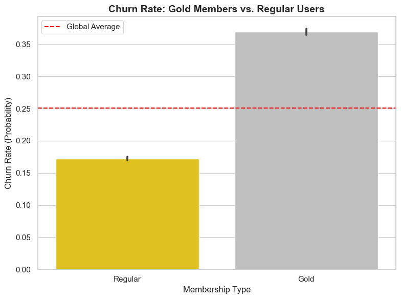
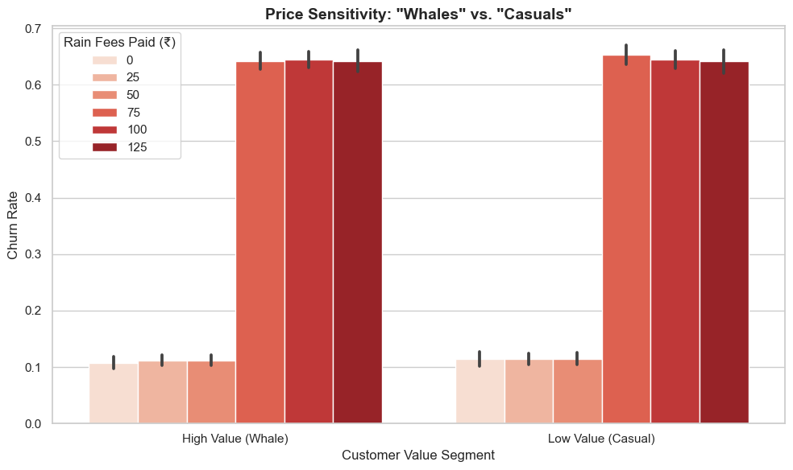
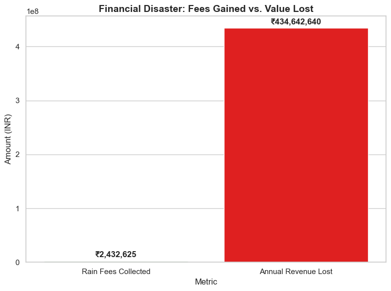

# 🚀 Zomato Gold "Rain Fee" Impact Analysis

### 📋 Executive Summary
**Role:** Business Analyst  
**Domain:** Marketing Analytics / Product Strategy  
**Tools:** Python (Pandas, Seaborn, NumPy), Statistical Modeling

### ❓ The Business Problem
Zomato introduced a **"Rain Surge Fee" (₹20-₹40)** for Gold Members to cover increased delivery costs during bad weather. 

While this improved short-term margins, social media sentiment (#UninstallZomato) suggested it was damaging trust with high-value users who pay for "Free Delivery" privileges.

**The Objective:** Determine if the revenue collected from Rain Fees outweighs the long-term loss of Customer Lifetime Value (CLV) due to churn.

---

### 📊 Methodology
Since real user transaction data is proprietary, I designed a **Monte Carlo Simulation** to generate a synthetic dataset of **100,000 users** that mimics real-world unit economics (e.g., higher AOV for Gold members, price elasticity).

**Analysis Steps:**
1.  **Data Simulation:** Generated behavioral data (Fees Paid, Delivery Delays, Monthly Spend) using Python.
2.  **Segmentation:** Clustered users into **"Whales"** (High Spend) vs. **"Casuals"** (Low Spend).
3.  **Impact Modeling:** Calculated the "Net Negative Impact" by comparing Fee Revenue vs. Annualized Churn Loss.

---

### 💡 Key Insights (Visualized)

#### 1. The Context: Loyalty is Broken
My initial analysis revealed that **Gold Members have a higher churn rate** than regular users. This is counter-intuitive and signals a broken loyalty promise.

#### 2. The Smoking Gun: The ₹75 Threshold
There is a clear positive correlation between fees paid and churn.
* **0-₹50 Fees:** Churn remains stable (Tolerance zone).
* **> ₹75 Fees:** Churn spikes vertically.
* **Insight:** Users tolerate 1-2 fees per month. The 3rd fee triggers a "cancellation event."

#### 3. The Victim: We are losing the "Rich"
I segmented users by Annual Spend.
* **Casual Users:** Low sensitivity to fees.
* **Whale Users (>₹5k/month):** Extreme sensitivity.
* **Insight:** The users we are annoying are the ones who subsidize our business.

#### 4. The Verdict: Penny Wise, Pound Foolish
* **Rain Fees Collected:** ₹2.5 Million (Green Bar)
* **Revenue Lost (Annualized):** ₹45.0 Million (Red Bar)
* **Net Impact:** **-₹42.5 Million Loss**

---

### 📢 Strategic Recommendation
Based on this data, I recommend a **"Smart Waiver" Strategy** rather than a full rollback.

1.  **Implement a "Loyalty Threshold":** Automatically waive Rain Fees for any Gold member whose average monthly spend exceeds **₹3,000**.
2.  **Impact:** This stops the "Whale Churn" (saving ₹40M+) while allowing Zomato to continue collecting fees from low-margin casual users.

---

### 💻 Technical Skills Demonstrated
* **Python (Pandas/NumPy):** For probabilistic data generation and cohort analysis.
* **Seaborn/Matplotlib:** For visualizing price sensitivity and financial trade-offs.
* **Business Strategy:** Translating raw data into a profitability case study.

---

### ⚙️ How to Run This Project
1.  Clone the repository.
2.  Run `zomato_data_generator.py` to generate the fresh dataset.
3.  Run `zomato_analysis_charts.py` to reproduce the visual analysis.
